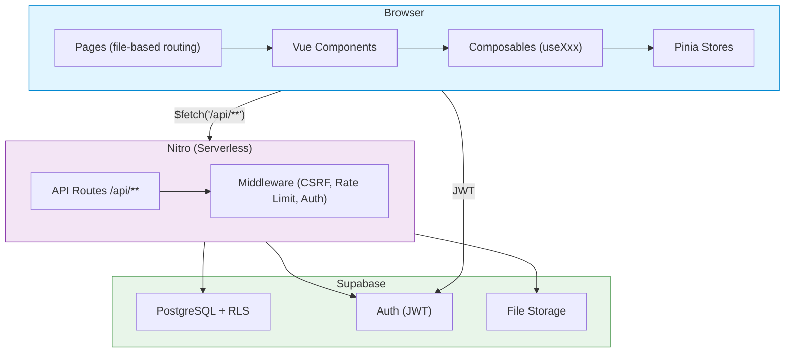

# The Recruiting Compass

A web app for managing high school athlete recruiting — track schools, coaches, interactions, and the recruiting timeline.

**Stack:** Nuxt 3 · Vue 3 · TypeScript · TailwindCSS · Pinia · Supabase · Vercel

---

## Architecture



**Request flow:** User action → Component → Composable → `$fetch` → Nitro route → Supabase → Pinia store update → UI re-render

---

## Quickstart

**Prerequisites:** Node.js 18+, a Supabase project, College Scorecard API key

```bash
npm install
cp .env.example .env.local   # fill in your credentials
npm run dev                   # http://localhost:3000
```

**`.env.local` required keys:**

```env
NUXT_PUBLIC_SUPABASE_URL=https://xxx.supabase.co
NUXT_PUBLIC_SUPABASE_ANON_KEY=your_anon_key
NUXT_PUBLIC_COLLEGE_SCORECARD_API_KEY=your_key
```

---

## Commands

| Command | Purpose |
|---|---|
| `npm run dev` | Dev server at localhost:3000 |
| `npm run build` | Production build |
| `npm run type-check` | TypeScript check |
| `npm run lint:fix` | ESLint + Prettier |
| `npm run test` | Vitest unit tests |
| `npm run test:e2e` | Playwright E2E tests |
| `npm run test:coverage` | Coverage report |

---

## Project Structure

```
pages/          # File-based routing (page = route)
components/     # Auto-imported Vue components (by domain)
composables/    # Reusable logic — useXxx() pattern
stores/         # Pinia state (mutate here only, not in components)
server/api/     # Nitro endpoints (file path = URL)
server/utils/   # Server-side utilities (validation, logging)
types/          # TypeScript definitions
utils/          # Client-side helpers
tests/
  unit/         # Vitest tests
  e2e/          # Playwright tests
docs/           # Technical documentation
planning/       # Implementation plans and specs
```

---

## Deployment

- **Staging:** auto-deploys from `develop` via GitHub Actions → Vercel
- **Production:** requires approval gate, deploys from `main` → Vercel
- **Build preset:** `vercel` (Nitro serverless functions for `/api/**`)

See [`docs/deployment/ci-cd.md`](docs/deployment/ci-cd.md) for setup details.

---

## Documentation

| Topic | Location |
|---|---|
| Architecture & diagrams | [`docs/architecture.md`](docs/architecture.md) |
| API endpoint reference | [`docs/api/API_ENDPOINT_DOCUMENTATION.md`](docs/api/API_ENDPOINT_DOCUMENTATION.md) |
| Database schema | [`docs/technical/DATABASE_SCHEMA.md`](docs/technical/DATABASE_SCHEMA.md) |
| Testing strategy | [`docs/development/testing.md`](docs/development/testing.md) |
| Deployment & CI/CD | [`docs/deployment/ci-cd.md`](docs/deployment/ci-cd.md) |
| Accessibility guide | [`docs/accessibility/guide.md`](docs/accessibility/guide.md) |
| User manual | [`docs/user/USER_MANUAL.md`](docs/user/USER_MANUAL.md) |
| Full docs index | [`docs/INDEX.md`](docs/INDEX.md) |

For development standards and architecture decisions, see [`CLAUDE.md`](CLAUDE.md).

---

## Contributing

See [`CONTRIBUTING.md`](CONTRIBUTING.md) for branch workflow, commit format, and PR process.
