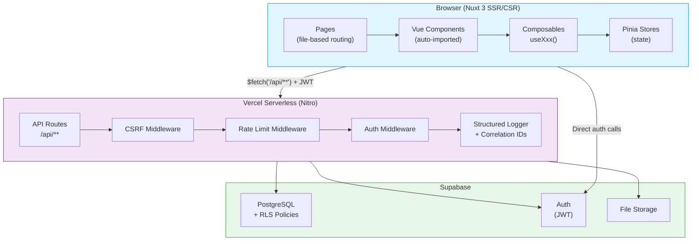
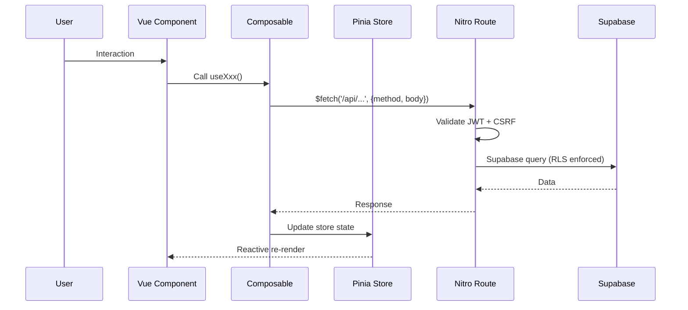

# System Architecture

## Overview

The Recruiting Compass is a Nuxt 3 full-stack application deployed to Vercel. The client renders with Vue 3, state lives in Pinia stores, and Nitro serverless functions serve all `/api/**` routes backed by Supabase PostgreSQL.

---

## System Diagram



---

## Request Flow



---

## Layer Responsibilities

| Layer | Location | Responsibility |
|---|---|---|
| **Pages** | `pages/` | Route definitions, layout composition |
| **Components** | `components/` | UI rendering, emit events |
| **Composables** | `composables/` | Data fetching, orchestration, local state |
| **Stores** | `stores/` | Global state, mutations (never in components) |
| **API Routes** | `server/api/` | Auth, validation, business logic |
| **Middleware** | `server/middleware/` | CSRF, rate limiting, request correlation |
| **Utils** | `server/utils/` | Validation, logging, shared helpers |

---

## Data Access Pattern

```
Page → Component → Composable (useXxx) → Pinia Store → Supabase / API
```

- Components **never** call Supabase directly
- Mutations happen **only** in Pinia actions
- Composables return `{ data, loading, error, fetchXxx }` refs

---

## API Routing (Nitro file-based)

```
server/api/
├── schools.get.ts              → GET  /api/schools
├── schools.post.ts             → POST /api/schools
├── schools/
│   ├── [id].get.ts             → GET  /api/schools/:id
│   ├── [id].put.ts             → PUT  /api/schools/:id
│   ├── [id].delete.ts          → DELETE /api/schools/:id
│   └── [id]/
│       ├── fit-score.get.ts    → GET  /api/schools/:id/fit-score
│       └── coaches.get.ts      → GET  /api/schools/:id/coaches
└── coaches/
    └── [id].get.ts             → GET  /api/coaches/:id
```

---

## Security

- **Authentication:** Supabase JWT, verified on every server route
- **Authorization:** RLS policies enforce row-level data ownership
- **CSRF:** Token required for all mutating endpoints (`server/middleware/csrf.ts`)
- **Rate limiting:** Per-IP limits on write endpoints
- **Input validation:** Zod schemas at API boundaries
- **Secrets:** Never in code — use `process.env.*` with runtime validation

---

## Key Decisions

| Decision | Choice | Reason |
|---|---|---|
| Package bundling | `nitro.externals.inline` | Vercel doesn't install deps at runtime |
| SSR teleport | Wrap in `<ClientOnly>` | `<Teleport>` crashes during SSR |
| HTML sanitization | `sanitize-html` | `isomorphic-dompurify` has ESM/CJS conflicts |
| State mutations | Pinia actions only | Predictable state, testable |

See [`/planning/lessons.md`](../planning/lessons.md) for evolving patterns.

---

## Detailed Docs

- [Database Schema](technical/DATABASE_SCHEMA.md)
- [Architecture Diagrams (extended)](technical/ARCHITECTURE_DIAGRAMS.md)
- [Feature Flow Diagrams](technical/FEATURE_FLOW_DIAGRAMS.md)
- [API Reference](api/API_ENDPOINT_DOCUMENTATION.md)
