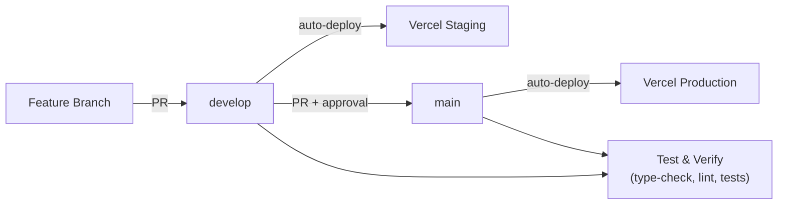

# Deployment & CI/CD

## Overview



- **Staging:** auto-deploys from `develop` after tests pass
- **Production:** requires manual approval after tests pass on `main`
- **Vercel preset:** `vercel` (Nitro serverless, API routes as serverless functions)

---

## GitHub Secrets Required

| Secret | Where to get it |
|---|---|
| `VERCEL_TOKEN` | [vercel.com/account/tokens](https://vercel.com/account/tokens) |
| `VERCEL_ORG_ID` | `.vercel/project.json` → `orgId` |
| `VERCEL_PROJECT_ID_STAGING` | Vercel dashboard → staging project |
| `VERCEL_PROJECT_ID_PROD` | Vercel dashboard → production project |
| `NUXT_PUBLIC_SUPABASE_URL` | Supabase project settings |
| `NUXT_PUBLIC_SUPABASE_ANON_KEY` | Supabase project settings |
| `NUXT_PUBLIC_COLLEGE_SCORECARD_API_KEY` | [api.data.gov/signup](https://api.data.gov/signup/) |

See `SECRETS.md` (root) for full secret inventory.

---

## Pre-commit Hooks

Hooks run automatically on `git commit`:

```bash
# Install
pip install pre-commit
pre-commit install
pre-commit install --hook-type pre-push

# Verify
pre-commit run --all-files
```

**What runs:**
1. ESLint — TypeScript/Vue syntax check + auto-fix
2. Prettier — code formatting
3. detect-secrets — blocks commits with API keys/secrets
4. nuxi typecheck — TypeScript validation (on push only)

**If hooks block a commit:**
- Auto-fixes apply: `git add . && git commit` again
- Secrets baseline false positive: `python3 -m detect_secrets scan > .secrets.baseline`
- Last resort: `git commit --no-verify` (never to fix source files)

---

## Coverage Requirements

| Metric | Threshold |
|---|---|
| Lines | 75% |
| Functions | 75% |
| Statements | 75% |
| Branches | 70% |

```bash
npm run test:coverage   # run with coverage
open coverage/index.html  # view HTML report
```

---

## Workflow Files

| File | Purpose |
|---|---|
| `.github/workflows/test.yml` | Type-check, lint, tests on all pushes/PRs |
| `.github/workflows/deploy-staging.yml` | Auto-deploy to staging on `develop` push |
| `.github/workflows/deploy-prod.yml` | Deploy to production on `main` push (with approval) |
| `.pre-commit-config.yaml` | Pre-commit hook configuration |

---

## Troubleshooting

**Staging deployment skips:** Verify push was to `develop` branch.

**"Invalid token" error:** Regenerate Vercel token, update GitHub secret.

**Production approval missing:** Check branch protection rules on `main`.

**Type errors in CI but not locally:** Run `npm run type-check` locally before push.
