```mermaid
graph TD
    A["🎓 Athlete Discovers App"] --> B["📝 Signs Up for Account"]
    B --> C["✉️ Confirms Email"]
    C --> D["👤 Creates Profile"]
    D --> E["🎯 Sets Preferences<br/>(Division, Region, Major)"]
    E --> F["🏫 Adds First School"]
    F --> G["👨‍🏫 Adds Coaches<br/>from School"]
    G --> H["✅ Logs First Interaction<br/>(past email or inquiry)"]
    H --> I["📅 Reviews Timeline<br/>& Current Phase"]
    I --> J{"Invite<br/>Parent?"}
    J -->|Yes| K["👨‍👩‍👧 Sends Parent Invite<br/>Parent Accepts"]
    J -->|No| L["✨ Onboarding Complete"]
    K --> L
    L --> M["🚀 Starts Using App<br/>Logs interactions,<br/>tracks progress"]

    style A fill:#e1f5ff
    style B fill:#e1f5ff
    style C fill:#e1f5ff
    style D fill:#fff9c4
    style E fill:#fff9c4
    style F fill:#c8e6c9
    style G fill:#c8e6c9
    style H fill:#c8e6c9
    style I fill:#f8bbd0
    style J fill:#f8bbd0
    style K fill:#ffe0b2
    style L fill:#b2dfdb
    style M fill:#c8e6c9
```

```mermaid
graph TD
    A["👨‍👧 Athlete Invites Parent"] --> B["📧 Parent Receives Email"]
    B --> C{"Parent<br/>Interested?"}
    C -->|No| D["❌ Invite Expires<br/>(7 days)"]
    C -->|Yes| E["🔗 Clicks Invite Link"]
    E --> F{"Has<br/>Recruiting<br/>Compass<br/>Account?"}
    F -->|No| G["📝 Creates Account<br/>(Email + Password)"]
    F -->|Yes| H["🔑 Logs Into<br/>Existing Account"]
    G --> I["✅ Accepts Invite<br/>& Links to Athlete"]
    H --> I
    I --> J["👀 Views Athlete<br/>Dashboard"]
    J --> K["🏫 Explores Schools<br/>& Coaches"]
    K --> L["📊 Checks Timeline<br/>Progress"]
    L --> M["💬 Reviews All<br/>Interactions"]
    M --> N["🔔 Enables<br/>Notifications"]
    N --> O["✨ Parent Access<br/>Complete"]
    O --> P["📱 Gets Notifications<br/>on Updates<br/>Monitors Progress"]

    style A fill:#ffe0b2
    style B fill:#ffe0b2
    style C fill:#f8bbd0
    style D fill:#ffccbc
    style E fill:#c8e6c9
    style F fill:#f8bbd0
    style G fill:#e1f5ff
    style H fill:#e1f5ff
    style I fill:#c8e6c9
    style J fill:#fff9c4
    style K fill:#fff9c4
    style L fill:#fff9c4
    style M fill:#fff9c4
    style N fill:#f8bbd0
    style O fill:#b2dfdb
    style P fill:#c8e6c9
```

```mermaid
graph TD
    A["🔍 Freshman: Research Phase"] --> B["📚 Builds Target List<br/>10-20 Schools"]
    B --> C["📧 Adds Coaches<br/>from Schools"]
    C --> D["⚾ Sophomore: Active Outreach"]
    D --> E["📤 Sends Intro Emails<br/>to Coaches"]
    E --> F["📞 Gets Responses<br/>from Coaches"]
    F --> G["🏟️ Attends Showcases<br/>& Tournaments"]
    G --> H["🎯 Junior: Peak Recruiting"]
    H --> I["🏫 Takes Campus Visits<br/>to Top Schools"]
    I --> J["🤝 Builds Coach<br/>Relationships"]
    J --> K["📋 Gets Recruited Survey<br/>from Coaches"]
    K --> L["🎁 Receives First Offer"]
    L --> M["⭐ Reviews Offer Terms"]
    M --> N["📊 Compares Offers<br/>(as more come in)"]
    N --> O["👨‍🎓 Senior: Decision Phase"]
    O --> P["🎬 Official Visits<br/>to Top 3-5"]
    P --> Q["💭 Discusses with Family<br/>& Advisor"]
    Q --> R["✍️ Makes Final Decision"]
    R --> S["🎊 Commits & Signs LOI"]
    S --> T["🏆 Celebration!<br/>Transitions to College"]

    style A fill:#e1f5ff
    style B fill:#e1f5ff
    style C fill:#e1f5ff
    style D fill:#c8e6c9
    style E fill:#c8e6c9
    style F fill:#c8e6c9
    style G fill:#c8e6c9
    style H fill:#fff9c4
    style I fill:#fff9c4
    style J fill:#fff9c4
    style K fill:#fff9c4
    style L fill:#f8bbd0
    style M fill:#f8bbd0
    style N fill:#f8bbd0
    style O fill:#ffe0b2
    style P fill:#ffe0b2
    style Q fill:#ffe0b2
    style R fill:#ffe0b2
    style S fill:#b2dfdb
    style T fill:#81c784
```

# Recruiting Compass: User Journey Maps

Visual diagrams of key user flows and recruiting journeys.

---

## Journey 1: New Athlete Onboarding (First-Time User)

### Narrative

A new student-athlete (age 14-18) discovers Recruiting Compass and sets up their account to start managing recruiting.

### Journey Map Diagram



### Journey Stages & Details

**Stage 1: Discovery** (Entry Point)

- Athlete hears about Recruiting Compass
- Sources: Product Hunt, Google, social media, friend referral
- Barrier: Skepticism ("Do I really need this?")
- Solution: Clear value prop + free access

**Stage 2: Account Creation** (Registration)

- Email signup (quick, 2 min)
- Password creation
- Email verification
- Barrier: Another password to remember
- Solution: SSO option (Google/Apple) in future

**Stage 3: Basic Profile** (Setup)

- High school, graduation year, position
- GPA, test scores (optional initially)
- Target divisions, regions
- Barrier: Don't know all preferences yet
- Solution: Can update anytime

**Stage 4: School Discovery** (Core Action)

- Search for 10-15 target schools
- Mix of reach, target, safety
- Set priority tiers
- Barrier: Overwhelming choice
- Solution: Fit scores guide recommendations

**Stage 5: Coach Management** (Data Entry)

- Find coaches at each school
- Enter contact info
- Barrier: Time-consuming data entry
- Solution: Search feature, coach database pre-populated

**Stage 6: First Interaction** (Building History)

- Log past email or inquiry
- Sets baseline timeline
- Barrier: Wasn't tracking before
- Solution: Can log past events anytime

**Stage 7: Timeline Review** (Context)

- Understand current phase
- See phase-appropriate tasks
- Barrier: Doesn't know recruiting timeline
- Solution: Template timeline guides them

**Stage 8: Parent Invitation** (Optional Collaboration)

- Send invite to parent/guardian
- Parent creates account and links
- Barrier: Requires parent engagement
- Solution: Easy invite flow, parents see value

**Stage 9: Ongoing Usage** (Habit Formation)

- Regular interaction logging
- Weekly timeline reviews
- Monthly progress checks
- Barrier: Remembering to update
- Solution: Email reminders, notifications

### Timeline

| Stage                | Duration   | Task                     |
| -------------------- | ---------- | ------------------------ |
| Discovery → Account  | 5 min      | Sign up, verify email    |
| Profile Setup        | 5 min      | Enter basic info         |
| School Search        | 20 min     | Add 10-15 schools        |
| Coach Entry          | 30 min     | Add coaches from schools |
| First Interaction    | 10 min     | Log past or current      |
| Timeline Review      | 5 min      | Understand phases        |
| Parent Invite        | 2 min      | Send invite link         |
| **Total Onboarding** | **80 min** | Complete setup           |

### Success Metrics

- ✅ Profile 75%+ complete
- ✅ 10+ schools added
- ✅ 20+ coaches added
- ✅ 3+ interactions logged
- ✅ Parent invited (optional)
- ✅ First timeline task started

### Key Insights

1. **Mobile-First**: Athlete likely on phone during signup—must be mobile-responsive
2. **Motivation**: Excited but unsure—guide them step-by-step
3. **Parent Involvement**: Want family involved early (80% invite parent within first week)
4. **Data Completeness**: Initial profile is 50-60% complete; fills out over time

---

## Journey 2: Parent Account Linking & Collaboration

### Narrative

A parent is invited by their athlete to see recruiting progress. They create an account, accept the invite, and start monitoring recruiting.

### Journey Map Diagram



### Journey Stages & Details

**Stage 1: Athlete Invitation** (Initiation)

- Athlete goes to Settings > Account & Collaboration
- Enters parent email
- Sends invite
- Barrier: Parent might not respond
- Solution: Follow-up reminders, clear CTA in email

**Stage 2: Email Receipt** (Awareness)

- Parent receives email with invite link
- May ignore if email goes to spam
- Barrier: Email overload, distrust (unfamiliar sender)
- Solution: Clear subject line, from trusted domain

**Stage 3: Interest Decision** (Consideration)

- Parent decides whether to accept
- Considers: Privacy (what will they see?), time commitment (how long?), value (is it useful?)
- Barrier: Concerns about tracking athlete
- Solution: Email explains parent view is read-only, athlete stays in control

**Stage 4: Link Click & Account Creation** (Conversion)

- Parent clicks invite link
- If no account: quick signup (email + password)
- If account exists: just accept invite
- Barrier: Another password to manage
- Solution: SSO (Google/Apple) for frictionless creation

**Stage 5: Linking & Authorization** (Connection)

- Accept invite and link to athlete
- Parent sees: "You now have access to [Athlete Name]'s recruiting profile"
- Barrier: Understanding what access means
- Solution: Clear explanation of what parent can see

**Stage 6: Dashboard Exploration** (Orientation)

- Parent views athlete's main dashboard
- Sees: Schools, coaches, interactions, timeline progress
- Barrier: Overwhelmed by data
- Solution: Guided tour or help tooltips

**Stage 7: Feature Discovery** (Engagement)

- Explore schools and coaches (see all targets)
- Check timeline progress (understand phase)
- Review interactions (see communication history)
- Barrier: Feature discovery takes time
- Solution: Help section, email tips, in-app guide

**Stage 8: Notification Setup** (Ongoing)

- Parent configures notifications
- Types: New interactions, timeline updates, milestones, offers
- Frequency: Real-time, daily digest, or weekly summary
- Barrier: Too many notifications = noise
- Solution: Preference center for custom settings

**Stage 9: Ongoing Monitoring** (Habit Formation)

- Parent checks app weekly
- Gets notifications on important updates
- Discusses progress with athlete
- Barrier: Overbearing parent micromanaging
- Solution: Read-only access keeps athlete in control

### Timeline

| Stage                       | Duration      | Task                    |
| --------------------------- | ------------- | ----------------------- |
| Invitation                  | 1 min         | Athlete sends invite    |
| Email Delivery              | Async         | Parent receives email   |
| Decision                    | 1-7 days      | Parent decides to join  |
| Link Click & Signup         | 5 min         | Create account (if new) |
| Accept Invite               | 1 min         | Link to athlete         |
| Dashboard Exploration       | 10 min        | View all data           |
| Setup Notifications         | 3 min         | Configure preferences   |
| **Total Parent Onboarding** | **20-30 min** | Complete setup          |

### Success Metrics

- ✅ Parent accepts invite (80%+ acceptance)
- ✅ Views dashboard at least once
- ✅ Explores schools and coaches
- ✅ Checks interactions/timeline
- ✅ Enables notifications
- ✅ Returns to app weekly

### Key Insights

1. **Skepticism**: Parents worry about privacy and athlete autonomy—reassure them with read-only access
2. **Value Clarity**: Parents need to understand how this helps family decision-making
3. **Simplicity**: Parent account setup must be dead simple (one click linking ideally)
4. **Transparency**: Parents appreciate seeing full communication history (builds trust)

---

## Journey 3: School Research to Commitment (Full Recruiting Cycle)

### Narrative

An athlete researches schools, builds relationships with coaches, receives offers, and ultimately commits to a college.

### Journey Map Diagram



### Journey Stages & Details

**Phase 1: FRESHMAN - Research (Ages 14-15)**

| Activity                    | Timeline   | Recruiting Compass Action                |
| --------------------------- | ---------- | ---------------------------------------- |
| Discover recruiting process | Sept-Oct   | Read guides, watch tutorials             |
| Build target school list    | Oct-Nov    | Add 10-20 schools by tier                |
| Research coaches            | Nov-Dec    | Add coaches, note positions they recruit |
| Attend local showcases      | Spring     | Log showcase attendance                  |
| Improve athletic skills     | Year-round | Update performance metrics               |
| Check fit scores            | Spring     | Review fit score breakdown               |

**Goal:** Get on coaches' radars, develop athletically
**Recruiting Compass Focus:** Organization, fit score understanding, timeline context

---

**Phase 2: SOPHOMORE - Active Outreach (Ages 15-16)**

| Activity                     | Timeline    | Recruiting Compass Action     |
| ---------------------------- | ----------- | ----------------------------- |
| Attend 2-3 summer showcases  | June-July   | Log interactions with coaches |
| Send intro emails to coaches | Summer      | Log email_sent interactions   |
| Update athletic profile      | Fall        | Update stats, test scores     |
| Respond to coach inquiries   | Ongoing     | Log emails_received           |
| Keep school list updated     | Fall-Spring | Add/remove schools as needed  |
| Monitor coach responsiveness | Ongoing     | Track response times          |

**Goal:** Build initial relationships, get invited to official visits
**Recruiting Compass Focus:** Interaction tracking, responsiveness monitoring, follow-up reminders

---

**Phase 3: JUNIOR - Peak Recruiting (Ages 16-17)**

| Activity                          | Timeline      | Recruiting Compass Action       |
| --------------------------------- | ------------- | ------------------------------- |
| Campus visits to top 10           | Fall-Spring   | Log campus_visit interactions   |
| Build relationships with coaches  | Ongoing       | Regular interaction logging     |
| Attend recruiting events/camps    | Winter        | Log event attendance            |
| Receive recruiting surveys        | Winter-Spring | Store documents, note deadlines |
| **First offers arrive**           | Spring        | Log offers, review terms        |
| More official visits (D1/D2)      | Spring        | Log official visit interactions |
| Update fit scores based on visits | Spring        | Review fit scores post-visit    |
| Consider additional schools       | Spring        | Add newly interested schools    |

**Goal:** Determine top 10-15 schools, get multiple offers, start narrowing list
**Recruiting Compass Focus:** Offer tracking, campus visit logging, coach relationship building, timeline progress

---

**Phase 4: SENIOR - Decision (Ages 17-18)**

| Activity                     | Timeline          | Recruiting Compass Action       |
| ---------------------------- | ----------------- | ------------------------------- |
| Narrow list to top 3-5       | Sept-Oct          | Focus on top-tier schools       |
| Official visits to finalists | Oct-Nov           | Log official visit interactions |
| Family meetings & discussion | Oct-Dec           | Share fit scores, pros/cons     |
| Make final decision          | Dec-Jan           | Document decision factors       |
| Commit verbally to school    | Dec-Jan           | Log commitment                  |
| Sign Letter of Intent (LOI)  | Feb (signing day) | Log signed LOI, celebrate!      |
| Transition planning          | Feb-Summer        | College planning (next chapter) |

**Goal:** Commit to college and sign LOI
**Recruiting Compass Focus:** Offer comparison, family decision-making, commitment tracking

---

### Key Milestones & Triggers

**Freshman Year Milestones:**

- [ ] First showcase attended
- [ ] 10+ schools added
- [ ] First interaction logged

**Sophomore Year Milestones:**

- [ ] First intro email sent
- [ ] Coach responds (positive interaction)
- [ ] 20+ interactions logged

**Junior Year Milestones:**

- [ ] First campus visit
- [ ] First offer received
- [ ] 50+ interactions logged

**Senior Year Milestones:**

- [ ] Narrowed to top 5 schools
- [ ] Official visits to finalists
- [ ] Committed to school
- [ ] LOI signed

### Timeline & Responsiveness

```
Freshman Year:
  Sept-May: Build skills, research schools
  Response rate: 20-40% (coaches building lists)

Sophomore Year:
  June-August: Active recruiting season
  Response rate: 60-80% (showcases, camps)

Junior Year (PEAK):
  Fall-Spring: Most active recruiting
  Response rate: 80%+ (coaches evaluating)

Senior Year:
  Fall-Winter: Finalization
  Response rate: 90%+ (coaches narrowing offers)
```

### Success Factors

1. **Consistency**: Logging interactions regularly (weekly, not just when remembered)
2. **Proactivity**: Reaching out to coaches, not just waiting for them
3. **Organization**: Keeping track of schools, deadlines, offer terms
4. **Communication**: Family discussion and alignment on decision
5. **Fit**: Choosing school that matches academically, athletically, personally

### Common Challenges & Solutions

| Challenge             | Why It Happens              | Recruiting Compass Solution             |
| --------------------- | --------------------------- | --------------------------------------- |
| Silent coaches        | Low interest or busy        | Recovery plan suggests re-engagement    |
| Too many schools      | Indecision or lack of focus | Fit scores help narrow list             |
| Missed deadlines      | Disorganization             | Timeline tasks + notifications          |
| Family disagreement   | Different priorities        | Shared parent access enables discussion |
| Pressure from coaches | Multiple offers competing   | Offer tracking + comparison tool        |

---

## Using These Journeys

### For Developers

- Understand user workflows before implementation
- Design features to support key journey moments
- Identify bottlenecks or pain points

### For Designers

- Create flows that guide users through journeys
- Design for each phase's specific needs
- Test with actual athletes/parents following these journeys

### For Marketing

- Use journeys in testimonial videos
- Highlight how Recruiting Compass solves pain points
- Create messaging tailored to each phase

### For Product

- Prioritize features that address key journey moments
- Measure success by journey completion rates
- Iterate based on user feedback at each stage

---

**User Journey Maps Version:** 1.0
**Last Updated:** 2026-01-26
**Status:** Production-ready for reference
