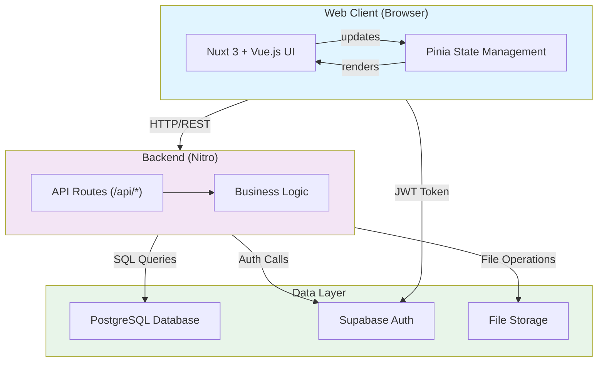
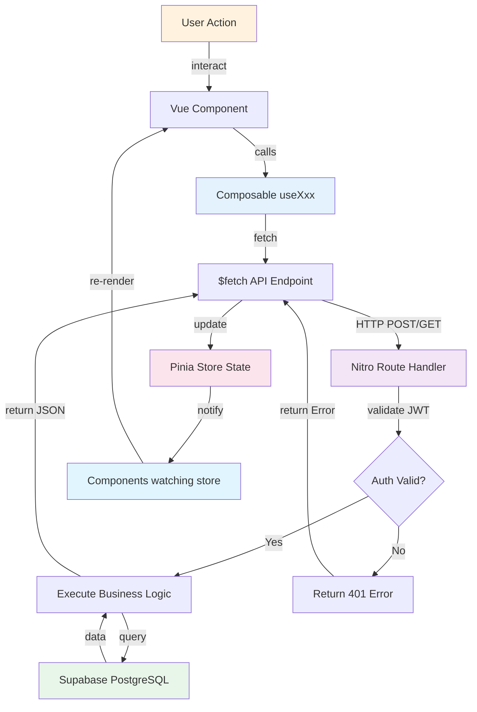
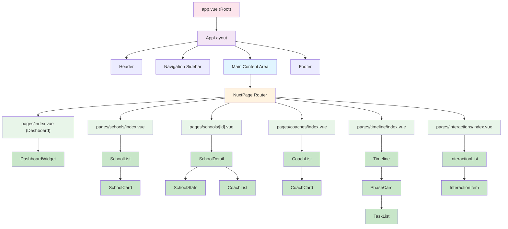
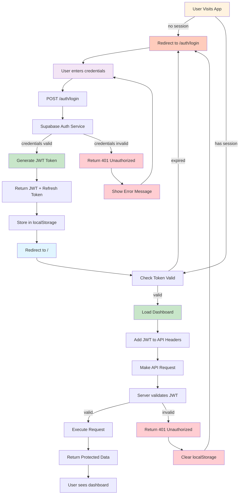
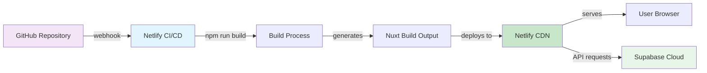

# Architecture Diagrams

This document provides visual representations of the system architecture, data flow, component hierarchy, and authentication flow for Recruiting Compass.

---

## 1. System Architecture

**Overview:** High-level system structure showing client, API, and database layers.



### Architecture Components

- **Web Client:** Nuxt 3 application running in the user's browser. Handles UI rendering, user interactions, and client-side state management.

- **Pinia Store:** Centralized state management for application data (schools, coaches, interactions, etc.). Persists user data and provides reactive updates.

- **API Layer (Nitro):** Server-side routing and business logic. Handles requests from the client, executes complex operations, and communicates with the database.

- **PostgreSQL Database:** Primary data store hosted on Supabase. Stores all user data, schools, coaches, interactions, templates, etc.

- **Supabase Auth:** Authentication service managing user registration, login, JWT tokens, and session management.

- **File Storage:** Supabase Storage for attachments, profile photos, and other files.

### Request Flow

1. User interaction in UI → Component emits action
2. Component calls composable function → Fetches data via API
3. API endpoint receives request with JWT token
4. Backend validates token, executes business logic
5. Database returns data
6. API sends response to client
7. Pinia store updates with response data
8. UI re-renders with updated state

---

## 2. Data Flow

**Overview:** Request-response cycle from user action to UI update.



### Data Flow Steps

1. **User Action:** User clicks button, fills form, navigates page
2. **Component:** Vue component receives event, calls method
3. **Composable:** Component calls composable (e.g., `useSchools()`)
4. **API Call:** Composable uses `$fetch` to call API endpoint
5. **HTTP Request:** Browser sends HTTP request with JWT in Authorization header
6. **Route Handler:** Nitro route receives request, validates JWT
7. **Auth Check:** Returns 401 if token invalid, continues if valid
8. **Business Logic:** Route handler executes logic (CRUD, calculations, etc.)
9. **Database Query:** Logic queries Supabase using Supabase client
10. **Data Retrieved:** Database returns requested data
11. **Response:** Route handler returns data as JSON
12. **Store Update:** Composable updates Pinia store with response
13. **Reactivity:** Store notifies all watching components
14. **Re-render:** Vue re-renders components with updated data
15. **UI Update:** User sees new state

---

## 3. Component Hierarchy

**Overview:** Vue component structure and nesting relationships.



### Component Organization

- **app.vue:** Root application component. Sets up layout and NuxtPage outlet.

- **AppLayout:** Main layout component. Contains header, navigation, footer.

- **pages/:** File-based routing. Each page corresponds to a URL route.
  - `pages/index.vue` → Dashboard (home page)
  - `pages/schools/*` → School management
  - `pages/coaches/*` → Coach management
  - `pages/timeline/*` → Timeline and phases
  - `pages/interactions/*` → Interaction log

- **components/:** Reusable components used across pages
  - `*Card` components for displaying single items (SchoolCard, CoachCard)
  - `*List` components for displaying collections (SchoolList, CoachList)
  - `*Detail` components for detail pages (SchoolDetail)
  - `*Widget` components for dashboard widgets (DashboardWidget)

### Data Flow Through Components

```
Page Component
  ↓ (mounted)
Composable (useXxx) - fetches data
  ↓
Pinia Store - centralized state
  ↓
Child Components - render from store
  ↓
User Interaction
  ↓
Composable Action - mutate data
  ↓
Store Update
  ↓
Components Re-render
```

---

## 4. Authentication Flow

**Overview:** User authentication, token management, and protected routes.



### Authentication Flow Details

#### 1. Initial Login

1. **User visits app** → No session in localStorage
2. **Middleware redirects** to `/auth/login`
3. **User enters credentials** (email, password)
4. **POST /auth/login** → Sends to Supabase Auth
5. **Supabase validates** credentials against user database
6. **If valid:** Generates JWT token + refresh token
7. **If invalid:** Returns 401 error, user sees error message
8. **Success:** Tokens stored in localStorage
9. **Redirect** to dashboard (`/`)
10. **Middleware validates** JWT and allows access

#### 2. API Authentication

1. **User makes API request** from component/composable
2. **$fetch adds JWT** to Authorization header: `Bearer <token>`
3. **API route receives** request with JWT
4. **Route validates JWT** with Supabase
5. **If valid:** Executes protected operation
6. **If invalid:** Returns 401 error
7. **Client receives 401** → Clears localStorage, redirects to login

#### 3. Token Refresh

1. **API returns 401** (token expired)
2. **Composable catches** error
3. **Uses refresh token** to request new JWT
4. **Supabase returns** new JWT
5. **Stores new JWT** in localStorage
6. **Retries original** API request with new JWT
7. **Request succeeds** with new token

#### 4. Logout

1. **User clicks logout**
2. **Clear localStorage** (remove JWT + refresh token)
3. **Call Supabase signOut** endpoint
4. **Redirect to login page**
5. **Next API request** has no token → 401 → redirect to login

### Security Considerations

- **JWT stored in localStorage:** Vulnerable to XSS attacks. Consider moving to HttpOnly cookie in future.
- **CORS:** API must allow requests from trusted origins only.
- **HTTPS only:** All communication must use HTTPS to prevent token interception.
- **Token expiry:** JWT should expire quickly (15-60 minutes) with refresh token for longer sessions.
- **Refresh token rotation:** Refresh tokens should be single-use to prevent replay attacks.

---

## Architecture Decisions

### Why Nuxt 3 + Vue 3?

- **File-based routing:** Reduces boilerplate, automatic route generation from file structure
- **Server-side rendering available:** Better SEO for landing pages
- **Built-in API routes:** Nitro provides simple backend without separate server
- **Auto-imports:** Components and composables automatically available without imports
- **Large ecosystem:** Mature library ecosystem, good documentation

### Why Pinia?

- **Lightweight:** Minimal overhead compared to Vuex
- **Composition API first:** Works naturally with Vue 3 Composition API
- **Automatic code splitting:** Only loaded stores are included in bundle
- **DevTools support:** Easy debugging with Pinia DevTools

### Why Supabase?

- **PostgreSQL-based:** Powerful SQL queries, full ACID compliance
- **Real-time capabilities:** Can add real-time updates later (subscriptions)
- **Built-in auth:** Reduces auth complexity
- **Row-level security:** Fine-grained access control at database level
- **Open source:** Can self-host if needed

### Why Server-Side API Routes?

- **Security:** Can keep sensitive operations server-side
- **Database access:** Server can query database directly
- **Secret management:** API keys, JWT secrets stored server-side only
- **Business logic:** Complex calculations done on server, not client

---

## Deployment Architecture



- **Source Code:** GitHub repository
- **CI/CD:** Netlify automatically builds and deploys on push to main
- **Build:** `npm run build` creates optimized production build
- **Hosting:** Netlify CDN hosts static files globally
- **API Requests:** Browser makes requests to Supabase API
- **Database:** Supabase PostgreSQL (hosted on AWS/GCP)

