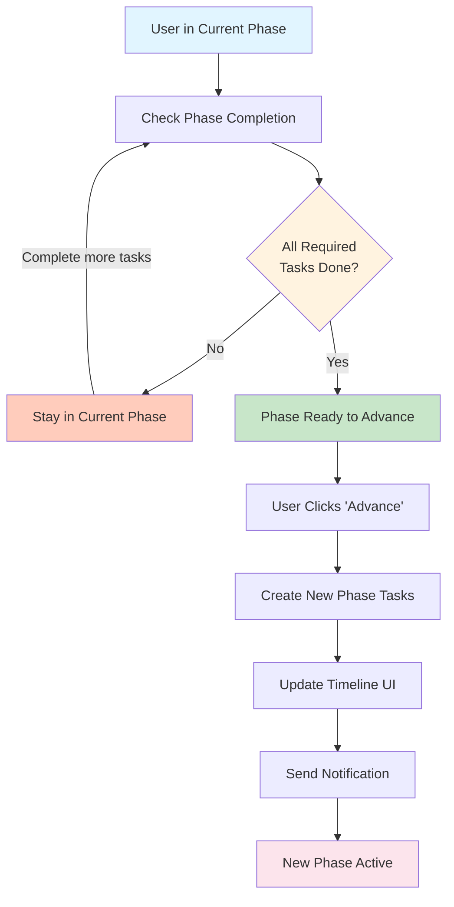
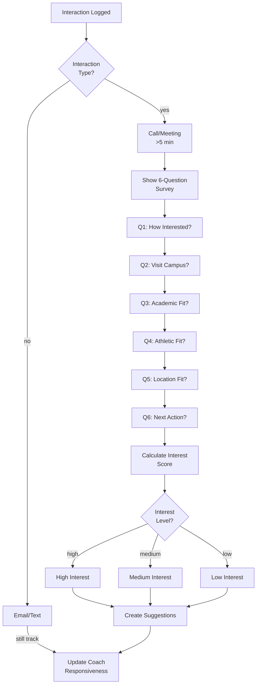
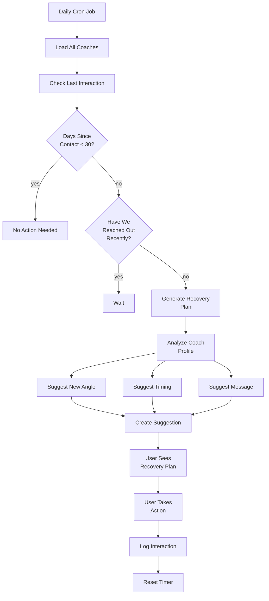

# Feature Flow Diagrams

This document provides detailed flow diagrams for core recruiting features, algorithms, and decision logic.

---

## 1. Timeline Phase Advancement

**Overview:** How users progress through the four-year recruiting timeline.



### Phase Advancement Logic

1. **Current Phase:** Freshman, Sophomore, Junior, or Senior
2. **Task Completion Check:** Verify all core tasks are marked complete
   - Core tasks are flagged with `required: true`
   - Optional tasks don't block advancement
3. **Advancement Gate:** Display "Ready to Advance" button only if all required tasks done
4. **User Clicks:** User initiates phase advancement
5. **New Tasks Created:** System loads phase-specific tasks for next phase
   - Fetch task definitions for new phase from database
   - Create task instances for user
   - Set all new tasks to "pending" status
6. **UI Update:** Timeline shows new phase, displays new task list
7. **Notification:** Send push/email notification: "You've advanced to [phase]!"
8. **State Update:** Update user's `current_phase` in database

### Code Reference

**Phase advancement endpoint:** `server/api/timeline/advance.post.ts`

```typescript
// Example logic
const { user_id } = await getUser(token);
const currentPhase = await getPhase(user_id);
const allTasksComplete = await checkPhaseCompletion(user_id, currentPhase);

if (allTasksComplete) {
  const nextPhase = getNextPhase(currentPhase);
  await createPhaseTasks(user_id, nextPhase);
  await updateUserPhase(user_id, nextPhase);
  return { success: true, newPhase: nextPhase };
}
```

---

## 2. Fit Score Calculation

**Overview:** Algorithm for calculating school-athlete matching scores.

```mermaid
graph TD
    A["Load User Profile"]
    B["Load School Profile"]
    C{Profile<br/>Complete?}
    D["Use Partial Data"]
    E["Calculate Academic Fit"]
    F["Calculate Athletic Fit"]
    G["Calculate Location Fit"]
    H["Calculate Program Fit"]
    I["Calculate Financial Fit"]
    J["Weight Components"]
    K["Generate Fit Score 1-10"]
    L["Store in Cache"]
    M["Return Fit Score"]

    A --> B
    B --> C
    C -->|No| D
    C -->|Yes| E
    D --> E
    E --> F
    F --> G
    G --> H
    H --> I
    I --> J
    J --> K
    K --> L
    L --> M

    style A fill:#e3f2fd
    style E fill:#c8e6c9
    style F fill:#c8e6c9
    style G fill:#c8e6c9
    style H fill:#c8e6c9
    style I fill:#c8e6c9
    style J fill=#fff3e0
    style K fill=#fce4ec

```

### Fit Score Components & Weighting

| Component | Weight | Calculation |
|-----------|--------|-------------|
| **Academic Fit** | 30% | `(userGPA/schoolGPA) * 10` capped at 10, adjusted for test scores |
| **Athletic Fit** | 30% | Compare user stats percentile vs. school recruit averages |
| **Location Fit** | 15% | Distance score + region preference match (1-10) |
| **Program Fit** | 15% | School reputation rank + coaching style alignment |
| **Financial Fit** | 10% | Scholarship availability for position + program budget |

### Calculation Formula

```
Fit Score = (0.30 × Academic) + (0.30 × Athletic)
          + (0.15 × Location) + (0.15 × Program) + (0.10 × Financial)
```

### Example Calculation

**User Profile:**
- GPA: 3.2 | Test Score: 1050 (SAT)
- Stats: 2.50 ERA, 92 mph fastball
- Location: Midwest preference
- Position: RHP (Right Handed Pitcher)

**School Profile (Duke):**
- Average GPA: 3.8 | Average SAT: 1520
- Typical pitcher ERA: 3.0 | Velocity: 94 mph
- Location: North Carolina (Southeast)

**Calculations:**
- Academic: (3.2/3.8) × 10 = 8.4 → Adjusted for test score = 7.8
- Athletic: (2.5/3.0) × 10 = 8.3 (ERA good relative to school)
- Location: 4 (far from Midwest preference)
- Program: 9 (top program, prestigious)
- Financial: 7 (limited athletic scholarships)

**Final Score:** (0.30 × 7.8) + (0.30 × 8.3) + (0.15 × 4) + (0.15 × 9) + (0.10 × 7)
= 2.34 + 2.49 + 0.60 + 1.35 + 0.70 = **7.48 → 7/10**

### Trigger Events

Fit scores are recalculated when:
- User updates profile (GPA, stats, location preference)
- New school added to list
- Performance metrics updated
- Schedule cron job (weekly recalculation)

### Code Reference

**Fit score calculation:** `server/api/schools/[id]/fit-score.get.ts`

```typescript
const calculateFitScore = async (userId, schoolId) => {
  const user = await getUser(userId);
  const school = await getSchool(schoolId);

  const academic = calculateAcademicFit(user, school);
  const athletic = calculateAthleticFit(user, school);
  const location = calculateLocationFit(user, school);
  const program = calculateProgramFit(user, school);
  const financial = calculateFinancialFit(user, school);

  const fitScore = Math.round(
    (0.30 * academic) + (0.30 * athletic) + (0.15 * location) +
    (0.15 * program) + (0.10 * financial)
  );

  return Math.min(10, Math.max(1, fitScore));
};
```

---

## 3. AI Suggestion Engine

**Overview:** How suggestions are generated and ranked.

```mermaid
graph TD
    A["Trigger Event"]
    A1["Daily Cron Job"]
    A2["Coach Interaction"]
    A3["Profile Update"]
    A --> A1
    A --> A2
    A --> A3

    B["Analyze User Profile"]
    C["Check Interaction History"]
    D["Check Timeline Phase"]
    E["Generate Candidates"]

    F["Follow-up Suggestions"]
    G["Fit Match Suggestions"]
    H["Activity Suggestions"]
    I["Milestone Suggestions"]

    E --> F
    E --> G
    E --> H
    E --> I

    J["Rank by Priority"]
    K["Filter Duplicates"]
    L["Store in Database"]
    M["Update Dashboard"]

    A1 --> B
    A2 --> B
    A3 --> B
    B --> C
    C --> D
    D --> E
    F --> J
    G --> J
    H --> J
    I --> J
    J --> K
    K --> L
    L --> M

    style A fill=#fff3e0
    style B fill#e3f2fd
    style E fill#f3e5f5
    style F fill#c8e6c9
    style G fill#c8e6c9
    style H fill#c8e6c9
    style I fill#c8e6c9
    style J fill#fff3e0
```

### Suggestion Types & Triggers

#### Follow-up Suggestions
**Trigger:** Coach contact is 45+ days old with no response from user

```
IF last_interaction_date < today - 45 days
   AND user_has_not_reached_out_recently
THEN create "Follow-up with [Coach] at [School]" suggestion
RANK: Medium-High (depends on coach responsiveness score)
```

#### Fit Match Suggestions
**Trigger:** New school added that matches profile well

```
IF school_fit_score >= 8.5
   AND school not in user_list
   AND school_matches_phase_requirements
THEN create "Consider adding [School] to your list" suggestion
RANK: Medium (depends on user tier distribution)
```

#### Activity Suggestions
**Trigger:** User's phase has recommended activities not completed

```
IF current_phase == "Junior"
   AND today == start_of_recruiting_season
   AND no_showcase_attendance_logged
THEN create "Attend recruiting showcases" suggestion
RANK: High (time-sensitive, phase-specific)
```

#### Milestone Suggestions
**Trigger:** User has completed all phase tasks

```
IF phase_completion_percentage == 100%
   AND current_phase != "Senior"
THEN create "You're ready to advance to [Next Phase]" suggestion
RANK: Highest (completion milestone)
```

### Ranking Algorithm

```
priority_score = base_score × recency_factor × relevance_factor

base_score = {
  milestone: 10,
  activity: 8,
  follow-up: 6,
  fit-match: 5
}

recency_factor = {
  within 1 week: 1.0,
  1-2 weeks: 0.8,
  2-4 weeks: 0.6,
  4+ weeks: 0.4
}

relevance_factor = {
  high: 1.0,
  medium: 0.8,
  low: 0.5
}
```

### Duplicate Filtering

- **Follow-up suggestions:** Don't suggest same coach if already have active follow-up suggestion
- **Fit match suggestions:** Don't suggest school if already on user's list
- **Activity suggestions:** Don't duplicate within same phase

### Code Reference

**Suggestion generation:** `server/api/suggestions/index.get.ts`

```typescript
const generateSuggestions = async (userId) => {
  const user = await getUser(userId);
  const schools = await getSchools(userId);
  const interactions = await getInteractions(userId);

  const suggestions = [];

  // Follow-up suggestions
  for (const coach of getCoachesBySilenceThreshold(interactions, 45)) {
    suggestions.push({
      type: 'follow-up',
      coach_id: coach.id,
      priority: getPriority(coach)
    });
  }

  // Fit suggestions
  for (const school of getCandidateSchools(user, schools)) {
    if (school.fit_score >= 8.5) {
      suggestions.push({
        type: 'fit-match',
        school_id: school.id,
        priority: 5
      });
    }
  }

  // Sort and return top suggestions
  return suggestions.sort((a, b) => b.priority - a.priority).slice(0, 5);
};
```

---

## 4. Interest Calibration Survey

**Overview:** Post-interaction survey and interest classification.



### Survey Questions & Scoring

| Question | Scale | Scoring |
|----------|-------|---------|
| How interested are you in [School]? | 1-10 | Direct score |
| Would you visit campus if invited? | Yes/No | Yes=+2, No=-2 |
| Good academic fit? | Yes/No/Unsure | Yes=+2, Unsure=0, No=-2 |
| Good athletic fit? | Yes/No/Unsure | Yes=+2, Unsure=0, No=-2 |
| Good location fit? | Yes/No/Unsure | Yes=+1, Unsure=0, No=-1 |
| Next action? | [Reach out/Wait/Follow-up/None] | Reach out=+1 |

### Interest Classification

**High Interest (Score 8+):** User genuinely interested
- Suggestion: Schedule campus visit
- Suggestion: Send follow-up email
- Add to priority outreach list

**Medium Interest (Score 4-7):** Interested but uncertain
- Suggestion: Log more interactions
- Suggestion: Attend camp if school hosts
- Monitor responsiveness

**Low Interest (Score <4):** Not interested or poor fit
- Suggestion: Consider removing from list
- Suggestion: Or focus on other schools
- Keep in list for reference but don't prioritize

### Trigger Rules

```
IF interaction_type == "call" OR interaction_type == "meeting"
   AND interaction_duration >= 5 minutes
THEN show_calibration_survey()

IF survey_submitted
   AND interest_score >= 7
   AND school_in_reach_tier
THEN suggest_campus_visit()

IF survey_submitted
   AND interest_score >= 8
   AND days_since_interaction == 3
THEN remind_send_followup_email()
```

---

## 5. Recovery Plan Trigger

**Overview:** How silent coaches are detected and re-engagement strategies are suggested.



### Recovery Plan Algorithm

#### Detection

```
FOR EACH coach in user_coach_list:
  last_interaction = coach.last_interaction_date
  days_silent = TODAY - last_interaction

  IF days_silent >= 30:
    IF user_has_reached_out_within_7_days:
      status = "waiting" (coach waiting for response)
    ELSE:
      status = "silent" (coach hasn't responded)

      IF status == "silent":
        generate_recovery_plan()
```

#### Recovery Plan Generation

**New Angle Suggestion:**
- Analyze coach's recruiting needs (position, profile)
- Look at past successful interactions
- Suggest new topic: "Mention your recent stats improvement"
- Or new connection: "Reference camp they're attending"
- Or different approach: "Email instead of phone"

**Optimal Timing Suggestion:**
- Check coach's recruiting calendar
- Look at past response patterns
- Suggest: "Reach out on Tuesday evening (their typical response time)"
- Avoid: "Don't email Friday night (never respond until Monday)"

**Sample Message:**
- Pull from email template library
- Personalize with coach name, school, recent stats
- Provide ready-to-send message: "Hi Coach [Name], just wanted to check in..."

### Code Reference

**Recovery plan generation:** `server/api/recovery-plan/[coachId].get.ts`

```typescript
const generateRecoveryPlan = async (userId, coachId) => {
  const coach = await getCoach(coachId);
  const interactions = await getCoachInteractions(userId, coachId);

  const daysSilent = getDaysSinceLastInteraction(interactions);

  if (daysSilent < 30) return null;

  const lastOutreach = getLastUserOutreach(interactions);
  if (lastOutreach && lastOutreach.days < 7) {
    return { status: 'waiting' };
  }

  const newAngle = suggestNewAngle(coach, interactions);
  const optimalTiming = suggestOptimalTiming(coach, interactions);
  const sampleMessage = generateSampleMessage(coach, interactions);

  return {
    status: 'silent',
    newAngle,
    optimalTiming,
    sampleMessage,
    daysSilent
  };
};
```

### Recovery Plan Success Metrics

- **Open rate:** % of users who see recovery plan
- **Action rate:** % of users who take suggested action
- **Response rate:** % of coaches who respond to recovery outreach
- **Re-engagement rate:** % of coaches who become active again

---

## Feature Implementation Order

**Priority 1 (MVP):**
- Timeline Phase Advancement
- Fit Score Calculation
- Interest Calibration

**Priority 2:**
- AI Suggestion Engine
- Recovery Plan Trigger

All features should include comprehensive error handling, logging, and monitoring.

