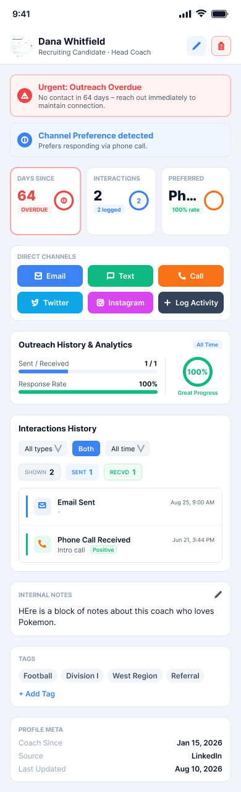

# iOS Spec — Coach Detail Follow-ups (session 2026-08-25)

> **Prepared:** 2026-08-25
> **Web branch:** `feat/stamp-coach-last-contact` (tip; stacks PRs #476–#485 off `develop`)
> **Purpose:** Bring the iOS coach detail screen to parity with five polish/behavior
> follow-ups shipped to web this session on top of the coach-detail redesign.

This is a **delta spec**. It assumes the base redesign already covered by
`planning/iOS_SPEC_coach-detail-redesign-2026-08-25.md` is landed/known on iOS.
Only the five follow-ups below are in scope.

---

## Figma design reference

**File:** Coach Detail — Web Capture
**iOS frame:** `coach-detail-ios`, node-id `13:4` (390×1276 pt, native mobile layout)
**Link:** https://www.figma.com/design/A4LleRjo8wP6djA4UqADzB/Coach-Detail-%E2%80%94-Web-Capture?node-id=13-4

The frame is the visual source of truth for the native mobile layout. Note that
it is a **web capture rendered at mobile width** — every section reads as a white
rounded card because that is the web design. iOS should honor the intent (logo
avatar, Call action, formatted phone, Days-Since ring, compact filter row, boxed
Send-Profile) using native SwiftUI idioms, not pixel-copy the web card chrome.

Node map (top→bottom, pt), for reference:

- **header-toolbar** (0,44,390,60): `avatar-tiny` 36×36 **rounded-rect = SCHOOL LOGO** (not initials/photo) + name(18)/role(13) stack; right actions edit + delete 32×32.
- **metrics-dashboard** (16,165,358,110): 3 equal tiles — Days Since (value 27pt + `OVERDUE` 11pt pill + 32×32 ring), Interactions (count + "N logged" + ring), Preferred (channel + "100% rate" + ring).
- **contact-grid-card** (16,291,358,122): 2 rows × 3 buttons — Email / Text / **Call**, Twitter / Instagram / Log Activity.
- **communication-analytics** (16,429,358,119): Sent/Received bar + Response Rate bar + 48×48 gauge.
- **interactions-section** (16,564,358,253): title; `filter-bar-mobile` (All types 79w · Both segmented 45w · All time 73w, height 25); summary pills SHOWN/SENT/RECVD; interaction rows 60h with 3px direction indicator.
- **notes-card** (16,833), **tags-card** (16,937), **profile-meta-card** (16,1051): Coach Since / Source / Last Updated.

---

## Feature Overview

Five targeted improvements to the coach detail screen:

1. Use the **school logo** as the coach avatar (initials only when the coach has no school).
2. Show the coach **phone formatted** `(XXX) XXX-XXXX`, tappable as a Call action.
3. Derive **Days Since Contact** from the most-recent logged interaction (fallback to the stored `last_contact_date`).
4. **Interactions filter bar** polish (web CSS only — iOS confirm-parity, see item 4).
5. **Send Recruiting Profile** presented as a boxed card, consistent with sibling sections.

---

## Web Implementation Summary

### Files changed (web, this session)
- `components/Coach/detail/CoachDetailHeader.vue` — avatar swapped to `<SchoolLogo>` when a school exists, initials `
` fallback otherwise (`v-else`).
- `components/Coach/detail/CoachIdentityCard.vue` — same avatar swap (xl logo) + new phone row (`toTelHref` + `formatPhoneDisplay`).
- `composables/useCoachInsights.ts` — new `lastContactAt` computed: max of loaded interactions' `occurred_at`, falling back to `coach.last_contact_date`; `daysSinceContact` now reads it.
- `components/Coach/detail/CoachInteractionsTable.vue` — filter selects given fixed `h-[40px]`, Direction segmented control wrapped with its own label (`hide-label` on the control) to match siblings, grid columns re-weighted so the Direction "Received" segment fits (`minmax(0,1.4fr)` for column 2).
- `components/coaches/CoachProfileLink.vue` — outer wrapper became a white card (`border border-slate-200 bg-white`).
- `pages/coaches/[id]/index.vue` — passes `:school` into `CoachDetailHeader` and `CoachIdentityCard`.
- `utils/phone.ts` — reused: `formatPhoneDisplay`, `toTelHref` (already mirrored on iOS as `PhoneFormatter`).

### DB / migration changes (ALREADY handled — no iOS work)
- `supabase/migrations/20260906000000_stamp_coach_last_contact_on_interaction.sql`:
  - `AFTER INSERT` trigger `trg_stamp_coach_last_contact` on `interactions` stamps
    `coaches.last_contact_date = GREATEST(existing, NEW.occurred_at)` (forward-only,
    `SECURITY DEFINER`). Fires for **every** interaction write path including iOS.
  - One-time backfill of `coaches.last_contact_date` from interaction history.
  - Applies to the shared prod DB (`xpxzhqghxecsjhvklsqg`); iOS gets the benefit
    automatically. **iOS ships no migration and no server code for this.**

---

## Existing iOS Files (keep — modify in place)

| File | Current state | Change needed |
|---|---|---|
| `Features/Coaches/Components/CoachDetailHeader.swift` | Big **initials gradient circle**; already receives `school: School?` but ignores its logo | Item 1 — swap to school favicon w/ initials fallback |
| `Features/Coaches/Components/ContactInfoSection.swift` | Phone row shows **raw** `coach.phone` (already tappable via `ContactRow` → Call/QuickComm) | Item 2 — format the displayed value |
| `Features/Coaches/ViewModels/CoachDetailViewModel.swift` | `computeStats().daysSinceContact` reads **only** `coach?.lastContactDateParsed` | Item 3 — derive from `recentInteractions`, fallback to stored |
| `Features/Coaches/Components/CoachInteractionsLogSection.swift` | Full capsule/menu **filter bar** already present (Type/Direction/Sentiment/Date range) | Item 4 — confirm-only, no change expected |
| `Features/Coaches/Views/CoachDetailView.swift` → `sendProfileSection` | Bordered button + stats, **not** boxed in a card | Item 5 — wrap in a card container (low priority) |
| `Features/Coaches/Components/CoachCardView.swift` | Contains `CoachCardSchoolLogoView` (favicon + initials fallback, rounded-rect) — **private** | Reference / extract for item 1 |
| `Shared/Utilities/PhoneFormatter.swift` | `formatDisplay`, `toE164US`, etc. — mirrors web `utils/phone.ts` | Reused for item 2 |

No new models, no new endpoints, no schema work.

---

## What iOS Needs to Build

### Item 1 — School logo as coach avatar  *(new work — NOT already done on iOS)*

**Parity flag (per coordinator request):** iOS does **not** currently use the
school logo as the coach avatar on the detail screen. `CoachDetailHeader.swift`
renders a 100pt **initials gradient circle** and ignores the `school` it is
already handed. So this is small, real work — not a no-op confirm. (The
favicon-with-initials-fallback pattern already exists elsewhere as the private
`CoachCardSchoolLogoView` inside `CoachCardView.swift`; reuse or extract it.)

- In `CoachDetailHeader`, when `school?.faviconUrl` resolves to a URL, render an
  `AsyncImage` school logo in place of the initials circle; on `.empty`/`.failure`
  or when `school == nil`, fall back to the existing initials avatar.
- Match the frame: rounded-rect (not a circle) for the logo; keep the existing
  gradient initials as the fallback shape. Preserve the accessibility-size scaling
  already in `CoachDetailHeader.Layout`.
- Recommended: extract `CoachCardSchoolLogoView` (currently `private` in
  `CoachCardView.swift`) into a shared `SchoolLogoAvatar` view so the header and
  the card share one implementation. Keep `accessibilityHidden(true)` on it.
- **No coach photos, ever** — the only two avatar states are school-logo and
  initials.

### Item 2 — Coach phone: formatted display + Call

- In `ContactInfoSection`, change the phone `ContactRow` value from the raw
  `phone` to `PhoneFormatter.formatDisplay(phone)`. The tap action (Call / Quick
  Communication) already exists via `ContactRow(type: .phone(phone))` — keep it;
  format the **display string** only, not the underlying dial target.
- The frame's `Call` button in the contact grid is satisfied by the existing
  phone `ContactRow` / Quick Communication path. No new Call button needed unless
  the redesign's contact grid is being built separately — in that case surface the
  phone as a Call action and show the formatted number.

### Item 3 — Days Since Contact from interaction history

- In `CoachDetailViewModel.computeStats()`, replace the `daysSinceContact` closure
  so it prefers the most recent loaded interaction:
  - Compute `latest = recentInteractions.compactMap(\.occurredAt-as-Date).max()`
    (the model already exposes `displayDate`, which parses `occurredAt` with the
    two ISO formatters — use that, guarding against the `.now`-default fallback if
    `occurredAt` is nil; simplest is to filter to interactions whose `occurredAt`
    is non-nil, then take `max(by:)` on `displayDate`).
  - If `latest` exists, days-since = `dateComponents([.day], from: latest, to: .now)`.
  - Else fall back to the existing `coach?.lastContactDateParsed` path.
- Rationale (parity with web): the loaded interaction history is the true last
  contact and is correct immediately, without depending on the DB trigger having
  fired or a coach refetch. The trigger (see below) keeps the stored field correct
  as a fallback and for list views that don't load history.
- **Trigger interaction:** because `trg_stamp_coach_last_contact` now advances
  `coaches.last_contact_date` on every interaction insert, iOS's stored-field
  fallback is also correct **after a refetch**. Deriving from loaded interactions
  is still recommended so the number updates in-session without a round-trip.

### Item 4 — Interactions filter bar  *(confirm-only — no iOS change expected)*

The web change was pure CSS: equal `40px` select heights, a unified small label on
the Direction control, and a wider Direction column so "Received" fits in the
4-column grid. iOS does not have that grid — `CoachInteractionsLogSection.filterBar`
already renders a horizontally-scrolling row of capsule `Menu`s covering **Type,
Direction, Sentiment, Date range**, which already matches the frame's compact
`filter-bar-mobile`. **Expected outcome: no code change.** Just verify the capsule
row still reads well and that "Both / Sent / Received" and the date-window labels
are present (they are). iOS additionally exposes a Sentiment filter that the mobile
frame crops out — keep it.

### Item 5 — Send Recruiting Profile boxed card  *(low priority)*

- Web wrapped the Send-Profile block in a white bordered card to match sibling
  cards. On iOS, `CoachDetailView.sendProfileSection` currently renders a bare
  `.bordered` button + stats. Wrap it in a card container (e.g. rounded rect with
  `Color(.secondarySystemBackground)` fill + separator stroke, matching the chrome
  `CoachCardView.fullBody` uses) so it reads as a boxed section like the others.
- This is cosmetic and depends on whether iOS adopts card-per-section globally for
  coach detail (the frame shows every section boxed because it is a web capture).
  If the iOS redesign kept sections as plain stacked groups, apply the same
  treatment consistently rather than boxing only this one. Defer if it would make
  Send-Profile the lone boxed section.

---

## API Endpoints to Call

**None new.** All five items are client-side rendering/derivation over data the
coach detail screen already loads (`coach`, `school`, `recentInteractions`). The
Send-Profile flow and interaction logging endpoints are unchanged.

---

## Data Models (Swift)

**No new models.** Fields already present and used:

- `Coach.phone: String?`, `Coach.lastContactDate: String?` (+ `lastContactDateParsed`), `Coach.schoolId`.
- `School.faviconUrl: String?`.
- `Interaction.occurredAt: String?` (+ `displayDate: Date`).

---

## Business Rules to Enforce Client-Side

- **Avatar precedence:** school logo (favicon) → initials. Never a coach photo. `school == nil` ⇒ initials.
- **Phone display:** `PhoneFormatter.formatDisplay` — complete US number ⇒ `(XXX) XXX-XXXX`; anything else ⇒ the original string unchanged. Dial/Call target stays E.164 via the existing `ContactRow` path.
- **Days Since Contact:** most-recent interaction `occurredAt` wins; fall back to stored `last_contact_date`; `nil` when neither exists (render the empty/`—` state, don't show 0).
- **Forward-only last-contact:** never let a backdated interaction reduce the shown days-since below the freshest contact — deriving from `max(occurredAt)` already guarantees this, mirroring the trigger's `GREATEST`.

---

## Excluded Items (No iOS Work Needed)

- **DB migration `20260906000000`** (trigger + backfill) — already applied to the shared prod DB; fires for iOS-logged interactions automatically.
- **RLS / server enforcement** — unchanged.
- **Web CSS polish (item 4 grid heights/widths)** — no iOS analog.
- **CSRF / email sending** — unchanged, web/server-only.

---

## Dependencies

- Coach detail redesign base (single-column detail with `CoachDetailHeader`,
  `ContactInfoSection`, `CoachInteractionsLogSection`, Send-Profile) must be in
  place — it is (files exist on `ci/e2e-dedicated-test-project`).
- `PhoneFormatter` (present) and a school-favicon avatar view (present as private
  `CoachCardSchoolLogoView`; extract to share).

---

## Notes for iOS Claude

- Confirm the branch/base first (`git -C <ios repo> branch --show-current`); iOS coach detail files were read on `ci/e2e-dedicated-test-project`.
- Prefer extracting `CoachCardSchoolLogoView` into a shared `SchoolLogoAvatar` rather than duplicating `AsyncImage` logic in the header.
- `Interaction.displayDate` defaults to `.now` when `occurredAt` is nil — for the days-since derivation, filter out nil-`occurredAt` interactions before taking the max so a malformed row can't masquerade as "today".
- Items 1–3 are the real work; item 4 is a verification; item 5 is optional polish gated on the section-chrome decision.

---

## Test Checklist

1. Coach **with** a school whose favicon resolves → header shows the school logo (rounded-rect); no initials.
2. Coach **with** a school but favicon fails/empty, or coach with **no** school → header shows the initials gradient avatar.
3. Coach with a complete US phone → Contact section shows `(440) 555-0134`; tapping still initiates a Call / Quick Communication to the correct number.
4. Coach with a non-standard/partial phone string → displayed unchanged (no mangling).
5. Coach with logged interactions → Days Since Contact matches the newest interaction's date; log a **newer** interaction in-session → number drops without needing a coach refetch.
6. Coach with **no** interactions but a stored `last_contact_date` → Days Since falls back to the stored value.
7. Coach with neither → Days Since shows the empty/`—` state (not 0, not OVERDUE).
8. Interactions filter bar still filters by Type, Direction (Both/Sent/Received), Sentiment, and Date range; "Clear" resets all.
9. Send Recruiting Profile reads as a boxed section consistent with its neighbors (if item 5 is taken).
